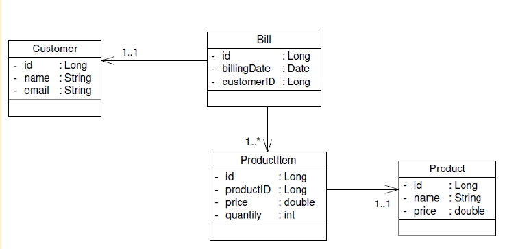

# Implementating a micro-service architecture with Spring Boot, Spring Cloud, Eureka, OpenFeign

This is a simple project to demonstrate how to implement a micro-service architecture with Spring Boot, Spring Cloud, Eureka, OpenFeign.

the idea is to create a simple micro-service architecture with 3 services:

- **customer-service** : a service to manage customers
- **product-service** : a service to manage products
- **billing-service** : a service to manage bills

then we will create a **gateway-service** to manage all the requests from the clients and redirect them to the appropriate service. firstlly the gateway-service will be configured staticlly on different ways (application.properties, application.yml, or java code using RouteLocator) then we will use **Eureka** to make it dynamic.

the other challenge is to make the communication between the services using **OpenFeign**.

the last step is building a angular front-end to consume the services.

## Prerequisites

- **Java 17**
- **Maven**
- **Node.js v18.12.1**
- **Angular CLI v16.0.3**
- **npm v9.6.7**

## Architecture


## customer-service & product-service

the dependecies needed for both services [customer-service](/customer-sevice/) and [product-service](inventory-service/) are:

- **spring Web**: to create a REST API
- **spring Data JPA**: to manage the data access
- **H2 Database**: to store the data
- **Rest Repositories**: to expose the data as REST resources
- **Eureka Discovery Client**: to register the service in the Eureka server
- **Lombok**: to generate the getters, setters, constructors, toString, equals and hashCode methods
- **Spring Boot DevTools**: Provides fast application restarts, LiveReload, and configurations for enhanced development experience.
- **Spring Boot Actuator**: to monitor and manage the application

## _customer-service_

the configuration applied are:

- **application.properties**:

```properties
server.port=8081
spring.application.name=customer-service
spring.datasource.url=jdbc:h2:mem:customer-db
spring.cloud.discovery.enabled=true
```

## _product-service_

the configuration applied are:

- **application.properties**:

```properties
server.port=8082
spring.application.name=product-service
spring.datasource.url=jdbc:h2:mem:product-db
spring.cloud.discovery.enabled=true
```

**Note that ```spring.cloud.discovery.enabled``` should be false until the eureka server configured**

## geteway-service

the dependecies needed for the [gateway-service](gateway-service/) are:

- **Gateway**: Provides a simple, yet effective way to route to APIs and provide cross cutting concerns to them such as security, monitoring/metrics, and resiliency.
- **Eureka Discovery Client**: a REST based service for locating services for the purpose of load balancing and failover of middle-tier servers.
- **Spring Boot Actuator**: Supports built in (or custom) endpoints that let you monitor and manage your application - such as application health, metrics, sessions, etc.

## _static configuration_

the configuration applied are:

- **application.properties**:

the **application.proerties** contains the basic configuration for the gateway like the port, name and it is the same for differents configurations:

```properties
server.port=8888
spring.application.name=geteway-server
spring.cloud.discovery.enabled=true
```

- **application.yml**:

```yml
spring:
  cloud:
    gateway:
      routes:
        - id : r1
          uri: http://localhost:8081
          predicates:
                - Path= /customers/**
        - id : r2
          uri: http://localhost:8082
          predicates:
                - Path= /products/**

```

- **RouteLocator**:

```java
@Bean
RouteLocator routeLocator(RouteLocatorBuilder builder){
return builder.routes()
        .route((r)->r.path("/customers/**").uri("lb://CUSTOMER-SERVICE"))
        .route((r)->r.path("/products/**").uri("lb://PRODUCT-SERVICE"))
        .build();
}
```

## _dynamic configuration_

Note that the dynamic configuration is applied after configuring the eureka server:

- **DiscoveryClientRouteDefinitionLocator**:

```java
@Bean
DiscoveryClientRouteDefinitionLocator definitionLocator(ReactiveDiscoveryClient rdc, DiscoveryLocatorProperties properties){

    return new DiscoveryClientRouteDefinitionLocator(rdc,properties);
}
```

## eureka-server

the only dependecie needed for the [eureka-server](eureka-server/) is:

- **Eureka Server**: spring-cloud-netflix Eureka Server.

eureka server is simple to implement you only need to add thos configuration lines :

```propreties 
server.port=8761
eureka.client.fetch-registry=false
eureka.client.register-with-eureka=false
```

then add the **@EnableEurekaServer** annotation to the main class.

## billing-service

the dependecies needed for the [billing-service](billing-service/) are:

- **spring Web**: to create a REST API
- **spring Data JPA**: to manage the data access
- **H2 Database**: to store the data
- **Rest Repositories**: to expose the data as REST resources
- **Eureka Discovery Client**: to register the service in the Eureka server
- **Lombok**: to generate the getters, setters, constructors, toString, equals and hashCode methods
- **Spring Boot DevTools**: Provides fast application restarts, LiveReload, and configurations for enhanced development experience.
- **Spring Boot Actuator**: to monitor and manage the application
- **OpenFeign**: Declarative REST Client. OpenFeign creates a dynamic implementation of an interface decorated with JAX-RS or Spring MVC annotations.
- **Spring HATEOAS**: Eases the creation of RESTful APIs that follow the HATEOAS principle when working with Spring / Spring MVC.

the configuration applied are:

- **application.properties**:

```properties
server.port=8083
spring.application.name=billing-service
spring.datasource.url=jdbc:h2:mem:billing-db
spring.cloud.discovery.enabled=true
```

also we need to add the **@EnableFeignClients** annotation to the main class.

the **billing-service** will communicate with the **customer-service** and the **product-service** using **OpenFeign**.

## _class diagram_

these is the class diagram that explain the billing-service and the communication with the other services:



## Test the backend

- **eureka interface**: <http://localhost:8761/>

all servoces are registered in the eureka server including the gateway-service:


- **product-service from geteway**: <http://localhost:8888/PRODUCT-SERVICE/products>


- **customer-service from geteway**: <http://localhost:8888/CUSTOMER-SERVICE/customers>


- **billing-service from geteway**: <http://localhost:8888/BILLING-SERVICE/fullBill/1>


## frontend

the frontend is a simple angular application that consume the backend services.

- **product page**: <http://localhost:4200/products>


- **customer page**: <http://localhost:4200/customers>


- **ordred page**: <http://localhost:4200/bills/1>


## How to run

- **Step 1** : run the **eureka-server** on port 8761
- **Step 2** : run the **gateway-service** on port 8888
- **Step 3** : run the **customer-service** on port 8081
- **Step 4** : run the **product-service** on port 8082
- **Step 5** : run the **billing-service** on port 8083
- **Step 6** : run the **frontend** on port 4200
